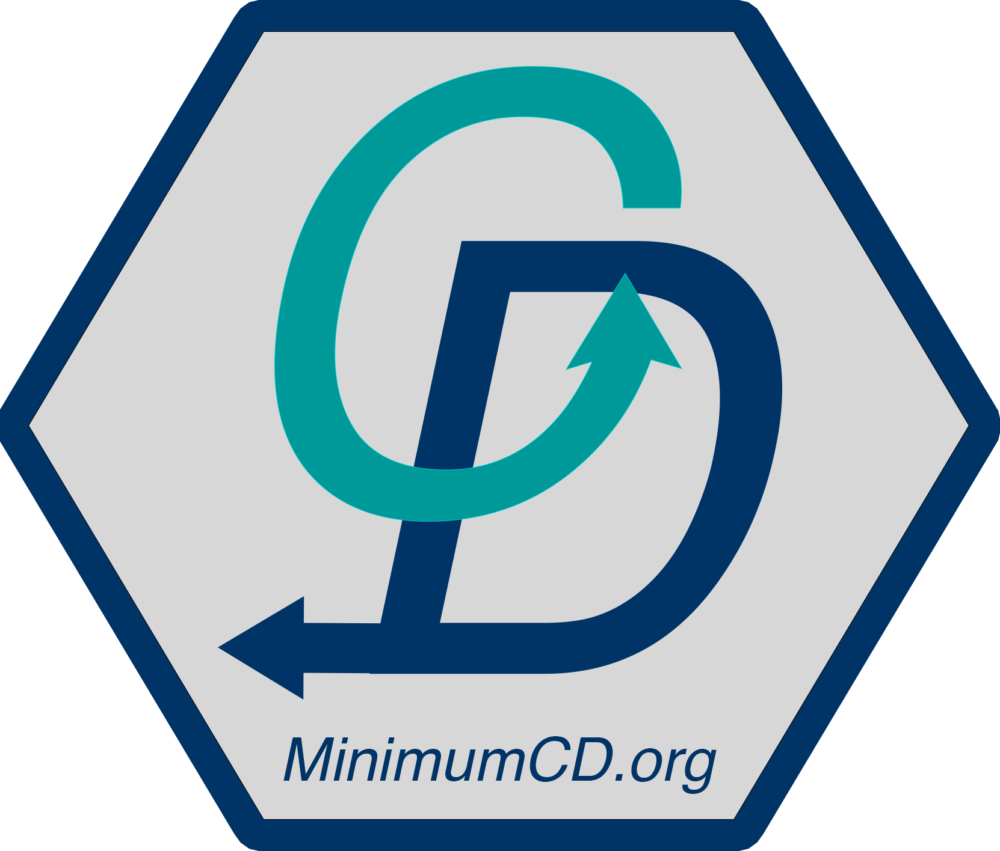
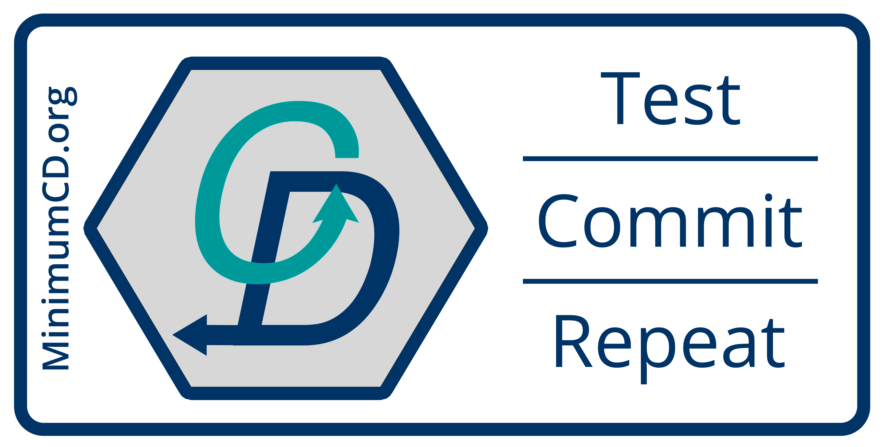

# Minimum Viable Continuous Delivery

This is a community project to define the minimum set of practices that give the expected improvements to outcomes, quality of life, and organizational structure that come with continuous delivery.

The website for this project, contained in this repo, is currently hosted at [MinimumCD.org](https://minimumcd.org/minimumcd/)

## Running Locally

This site uses NPM scripts to automate style checks.

`npm ci` will install all pre-commit hooks to verify style errors and test before allowing commits.

`npm test` will validate formatting. This will also run automatically as a pre-commit hook.

`npm start` will run the site locally.

`npm run build` will create the static site if you need to see the resulting structure.

## Contributing

Please see the [contribution](CONTRIBUTING.md) page for adding signatures or suggesting improvements.

If you'd like to submit a translation, please see the suggestions [here](TRANSLATING.md).

## Starchart

## Stargazers over time

## Stickers

Want to print stickers? You can find our logo images [here](https://github.com/Minimum-CD/cd-manifesto/blob/master/static/images)

## Tool info

Built with [Hugo](https://gohugo.io/)

[Theme](https://docport.netlify.app/docport-theme/) documentation
