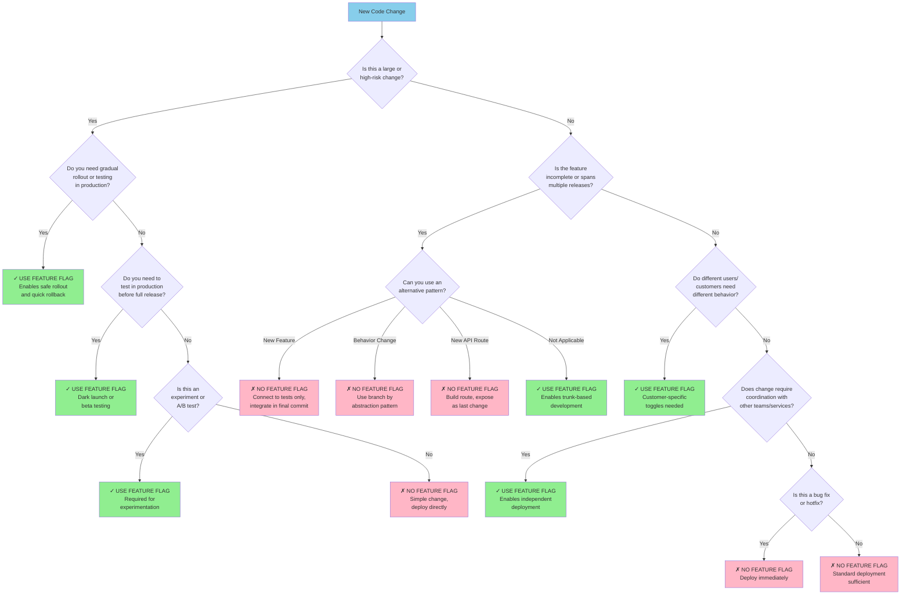

Feature flags are a useful tool. However, they are also often misused because people fail to consider other options when
it comes to hiding incomplete features to enable frequent code integration. Below is a chart that covers common
reasons people reach for feature flags and why some of those reasons are wrong. Also, you don't need a complicated tool for
feature flags... until you do. See the section below the decision tree for examples of feature flag implementation based
on use case.

## Feature Flag Implementation Approaches

### Static Code-Based

Hardcoded constants, configuration files, environment variables
Changes require deployment or restart
Best for: Stable flags, environment-specific behavior

### Dynamic In-Process

Database queries, cache lookups, file watching
Changes take effect without restart
Best for: Simple dynamic flags within a single application

### Centralized Service

Dedicated flag service (self-hosted or SaaS)
HTTP/RPC calls to fetch flag state
Best for: Multiple applications, complex targeting, team collaboration

### Infrastructure Routing

Load balancer rules, reverse proxy logic, service mesh routing
Traffic directed based on headers, cookies, or user attributes
Best for: Routing to entirely different services/versions

### Edge/Gateway Level

API gateway, CDN, edge computing platforms
Flag evaluation at the network edge before reaching application
Best for: Global scale, minimal latency impact, frontend routing

### Hybrid/Multi-Layer

Combination of application logic + infrastructure routing
Different layers for different concerns (kill switch vs. granular logic)
Best for: Complex systems requiring defense in depth

Key Decision Factors

- Dynamism: How quickly must flags change? (deployment vs. runtime)
- Scope: Single service vs. multiple services vs. entire infrastructure
- Targeting complexity: Boolean vs. user segments vs. percentage rollouts
- Performance: Acceptable latency for flag evaluation
- Operational burden: What infrastructure can your team maintain?
- Cost: Build vs. buy tradeoffs
