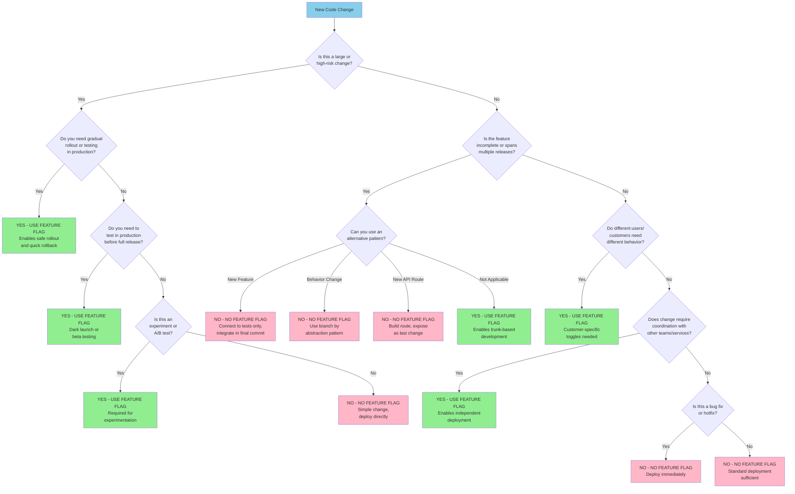

Feature flags are a useful tool. However, they are also often misused because people fail to consider other options when
it comes to hiding incomplete features to enable frequent code integration. Below is a chart that covers common
reasons people reach for feature flags and why some of those reasons are wrong. Also, you don't need a complicated tool for
feature flags... until you do. See the section below the decision tree for examples of feature flag implementation based
on use case.



## Feature Flag Implementation Approaches

### Static Code-Based

Hardcoded constants, configuration files, environment variables
Changes require deployment or restart
Best for: Stable flags, environment-specific behavior

### Dynamic In-Process

Database queries, cache lookups, file watching
Changes take effect without restart
Best for: Simple dynamic flags within a single application

### Centralized Service

Dedicated flag service (self-hosted or SaaS)
HTTP/RPC calls to fetch flag state
Best for: Multiple applications, complex targeting, team collaboration

### Infrastructure Routing

Load balancer rules, reverse proxy logic, service mesh routing
Traffic directed based on headers, cookies, or user attributes
Best for: Routing to entirely different services/versions

### Edge/Gateway Level

API gateway, CDN, edge computing platforms
Flag evaluation at the network edge before reaching application
Best for: Global scale, minimal latency impact, frontend routing

### Hybrid/Multi-Layer

Combination of application logic + infrastructure routing
Different layers for different concerns (kill switch vs. granular logic)
Best for: Complex systems requiring defense in depth

Key Decision Factors

- Dynamism: How quickly must flags change? (deployment vs. runtime)
- Scope: Single service vs. multiple services vs. entire infrastructure
- Targeting complexity: Boolean vs. user segments vs. percentage rollouts
- Performance: Acceptable latency for flag evaluation
- Operational burden: What infrastructure can your team maintain?
- Cost: Build vs. buy tradeoffs

## Temporary Feature Flag Lifecycle

Most feature flags should be temporary. Leaving flags in place indefinitely creates technical debt, increases complexity, and makes the codebase harder to maintain. Follow this lifecycle for temporary feature flags:

### 1. Create Flag with Removal Plan

**Before writing any code**, create the flag with a clear removal strategy:

**Create backlog items:**

- Story: Implement feature behind flag
- **Cleanup story: Remove feature flag** (add this immediately to backlog)

**Document the flag:**

```javascript
// TEMPORARY FLAG - Remove after rollout complete
// Removal ticket: PROJ-1234
// Created: 2025-01-15
// Expected removal: 2025-02-15 (30 days after rollout)
const ENABLE_NEW_CHECKOUT = featureFlags.get('new-checkout')
```

**Set an expiration date** - Most flags should be removed within 2-4 weeks after full rollout.

### 2. Deploy Flag in OFF State

**Initial deployment validates the flag mechanism:**

```javascript
// Day 1: Deploy flag infrastructure
if (featureFlags.get('new-checkout')) {
  return renderNewCheckout() // Not yet accessible
}
return renderOldCheckout() // Current behavior
```

**Commit and deploy with flag OFF:**

- Validates flag can be toggled without code changes
- Confirms flag infrastructure is working
- No user-facing changes yet

### 3. Build Feature Incrementally

**Integrate code to trunk daily while flag is OFF:**

```javascript
// Day 2-5: Build feature behind flag
function NewCheckout() {
  // New implementation being built
  // Can be integrated daily because flag is OFF
}

if (featureFlags.get('new-checkout')) {
  return <NewCheckout /> // Still OFF in production
}
return <OldCheckout />
```

Each commit:

- Has passing tests for the new feature
- Doesn't affect production users (flag is OFF)
- Integrates to trunk daily

### 4. Test in Production (Dark Launch)

**Turn flag ON for internal users only:**

```javascript
// Enable for employees, beta testers, or specific test accounts
const newCheckoutEnabled = featureFlags.get('new-checkout', {
  userId: currentUser.id,
  userGroups: currentUser.groups,
})
```

**Validation checklist:**

- Feature works as expected in production environment
- No performance degradation
- Error rates remain normal
- Monitoring and alerts functioning

### 5. Gradual Rollout

**Progressively increase user exposure:**

```javascript
// Day 6: Enable for 1% of users
// Day 7: Enable for 5% of users
// Day 8: Enable for 25% of users
// Day 9: Enable for 50% of users
// Day 10: Enable for 100% of users
```

**Monitor at each stage:**

- Error rates
- Performance metrics
- User feedback
- Business metrics

**Rollback immediately if issues detected** - This is the primary value of the flag.

### 6. Complete Rollout

**Once 100% of users have the new feature:**

```javascript
// All users now see new feature
const newCheckoutEnabled = featureFlags.get('new-checkout') // Returns true
```

**Wait for stability period:**

- Run at 100% for 3-7 days
- Confirm no issues emerge
- Verify rollback is no longer needed

### 7. Remove the Flag (CRITICAL)

**This step must not be skipped:**

**Week 1-2 after 100% rollout:**

- Prioritize the cleanup story
- Remove flag checks from code
- Delete flag configuration
- Remove flag from flag management system

**Before:**

```javascript
if (featureFlags.get('new-checkout')) {
  return <NewCheckout />
}
return <OldCheckout />
```

**After:**

```javascript
// Flag removed - new checkout is now standard behavior
return <NewCheckout />
```

**Complete cleanup:**

- Remove old implementation code
- Remove flag-related tests
- Remove flag documentation
- Update monitoring/alerts if needed

### Lifecycle Timeline Example

| Day   | Action                                             | Flag State  |
| ----- | -------------------------------------------------- | ----------- |
| 1     | Deploy flag infrastructure + create removal ticket | OFF         |
| 2-5   | Build feature behind flag, integrate daily         | OFF         |
| 6     | Enable for internal users (dark launch)            | ON for 0.1% |
| 7     | Enable for 1% of users                             | ON for 1%   |
| 8     | Enable for 5% of users                             | ON for 5%   |
| 9     | Enable for 25% of users                            | ON for 25%  |
| 10    | Enable for 50% of users                            | ON for 50%  |
| 11    | Enable for 100% of users                           | ON for 100% |
| 12-18 | Stability period (monitor)                         | ON for 100% |
| 19-21 | **Remove flag from code**                          | DELETED     |

**Total lifecycle: ~3 weeks from creation to removal**

## Long-Lived Feature Flags

Some flags are intentionally permanent and should be managed differently:

### Operational Flags (Kill Switches)

**Purpose:** Disable expensive features under load
**Lifecycle:** Permanent
**Management:** Treat as system configuration, document clearly

```javascript
// PERMANENT FLAG - System operational control
// Used to disable expensive features during incidents
const enableRecommendations = featureFlags.get('enable-recommendations')
```

### Customer-Specific Toggles

**Purpose:** Different customers get different features
**Lifecycle:** Permanent (tied to customer contracts)
**Management:** Part of customer configuration system

```javascript
// PERMANENT FLAG - Customer entitlement
// Controlled by customer subscription level
const hasAdvancedAnalytics = customer.subscription.includes('analytics')
```

### Experimentation Flags

**Purpose:** A/B testing and experimentation
**Lifecycle:** Permanent flag, temporary experiments
**Management:** Experiment metadata has expiration, flag infrastructure is permanent

```javascript
// PERMANENT FLAG - Experimentation platform
// Individual experiments expire, platform remains
const variant = experiments.get('checkout-optimization')
```

**Mark permanent flags clearly:**

- Document why they're permanent
- Different naming convention (e.g., `KILL_SWITCH_*`, `ENTITLEMENT_*`)
- Separate from temporary flags in management system
- Regular review to confirm still needed

## Anti-Patterns to Avoid

**Don't skip the removal ticket:**

- WRONG: "We'll remove it later when we have time"
- RIGHT: Create removal ticket when creating the flag

**Don't leave flags indefinitely:**

- WRONG: Flag still in code 6 months after 100% rollout
- RIGHT: Remove within 2-4 weeks of full rollout

**Don't create nested flags:**

- WRONG: `if (featureA && featureB && featureC)`
- RIGHT: Each feature has independent flag, removed promptly

**Don't forget to remove the old code:**

- WRONG: Flag removed but old implementation still in codebase
- RIGHT: Remove flag AND old implementation together

**Don't make all flags permanent "just in case":**

- WRONG: "Let's keep it in case we need to rollback in the future"
- RIGHT: After stability period, rollback is via deployment, not flag
